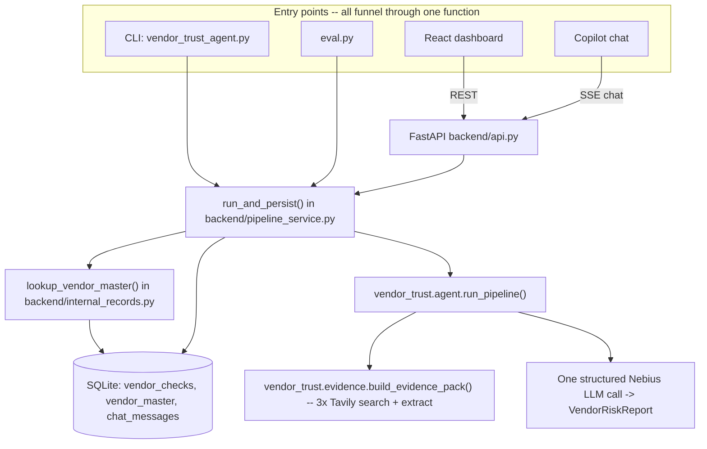

# Vendor Trust Agent

A Tavily-powered, cited, pre-payment vendor risk check designed to plug into an accounts-payable (AP) invoice review step. Give it a vendor name (and optionally an address and invoice amount) and it returns a structured, source-linked risk report — a guardrail before payment, not a replacement for AP process or formal vendor due diligence.

Two ways to use it, both backed by the exact same pipeline and the exact same SQLite history:

- **CLI** — a single vendor check, printed to the terminal.
- **Web dashboard** — a browser UI with check history, KPIs, an observability view, and a grounded, agentic copilot you can ask questions or trigger new checks through.

```
$ uv run vendor_trust_agent.py "Acme Textiles LLC" --address "Dallas, TX" --invoice-amount 45231.00

Invoice $45,231.00 | Risk: NEEDS_MANUAL_REVIEW | Hold payment for manual verification
before payment — remittance details could not be independently confirmed.
```

## Setup

1. **Tavily API key** — [app.tavily.com](https://app.tavily.com) (free tier: 1,000 credits/month)
2. **Nebius API key** — [tokenfactory.nebius.com](https://tokenfactory.nebius.com)
3. **Langfuse keys** (optional, for tracing) — [cloud.langfuse.com](https://cloud.langfuse.com) free tier
4. Install [`uv`](https://docs.astral.sh/uv/) if you don't have it: `curl -LsSf https://astral.sh/uv/install.sh | sh`
5. Copy `.env.example` to `.env` and fill in the keys above:
   ```
   cp .env.example .env
   ```
6. `uv sync` will install dependencies automatically on first run — no separate install step needed.

## CLI usage

```bash
uv run vendor_trust_agent.py "Acme Textiles LLC" --address "Dallas, TX" --invoice-amount 45231.00
```

| Flag | Required | Description |
|---|---|---|
| `vendor_name` (positional) | Yes | Vendor name to check |
| `--address` | No | Vendor address/location, if known — improves entity-consistency checking and internal vendor-master matching |
| `--invoice-amount` | No | Invoice amount pending payment — carried through into the report and business framing |
| `--model` | No | Nebius model name (default: `moonshotai/Kimi-K2.6`) |

Every CLI check is persisted to the same SQLite database the web dashboard reads from (tagged `source="cli"`), and — best-effort — if the DB write itself fails, the CLI still prints the completed, already-paid-for result rather than losing it.

Run the labeled fixture eval:

```bash
uv run eval.py
```

## Web dashboard

A React dashboard (Overview, Checks/History, Fabric-style Copilot chat, Observability) served by the same FastAPI backend that exposes the REST API. One process, one port, in production mode:

```bash
# 1. One-time: seed real historical checks + an internal vendor-master
#    seed list (see "Real vendor data" below) -- makes real Tavily +
#    Nebius calls, ~5-10 minutes, real (small) API cost.
uv run python -m backend.seed

# 2. Build the frontend once.
cd frontend && npm install && npm run build && cd ..

# 3. Serve API + built frontend from one process/port.
uv run uvicorn backend.api:app --reload
```

Open `http://localhost:8000`.

**Frontend-only hot-reload during development** (proxies `/api/*` to the backend on :8000):

```bash
# terminal 1
uv run uvicorn backend.api:app --reload
# terminal 2
cd frontend && npm run dev
```

Open `http://localhost:5173`.

### Pages

| Page | What it shows |
|---|---|
| **Overview** | Top-line KPIs (total checks, $ flagged for review, $ auto-cleared, avg cost/check), an internal-discrepancy alert banner, recent checks, and a "Run New Check" panel that triggers a real, live check. |
| **Checks** | Full check history (search/filter by vendor name, tier, source) + the internal Vendor Master tab (the client's approved-vendor system of record). Click through to a full report with every signal and citation. |
| **Copilot** | A grounded, agentic chat: ask about past checks (structured filter), ask "have we seen a pattern like this before" (semantic search across every past finding), ask whether a vendor is on the approved list, or ask it to run a brand-new live check — all in natural language, always cited. |
| **Observability** | Per-check cost/tokens/latency table with a "View trace" deep link into Langfuse for that specific run, aggregate spend/latency cards, and a lightweight spend-over-time chart. Deliberately thin — Langfuse already owns deep LLM tracing; this is the business-metrics view on top of it. |

### Backend tests

```bash
uv run pytest backend/tests/
```

Every test runs against an isolated temp-file SQLite DB and a mocked pipeline/LLM call — no test in the suite makes a real Tavily or Nebius API call.

## Models in use

One LLM throughout: Nebius-hosted **`moonshotai/Kimi-K2.6`** (via Nebius Token Factory's OpenAI-compatible API), used for both the main pipeline's structured synthesis call and the copilot's tool-calling loop — same model, same manual-JSON-action-parsing workaround (see [`vendor_trust/json_utils.py`](vendor_trust/json_utils.py) and the Technical Statement).

Retrieval in this app is deliberately hybrid, and each piece is picked for the actual shape of the data it's searching, not applied uniformly:

- **Structured filtering** — the copilot's `search_past_checks` tool and the dashboard's checks list filter by exact fields (vendor name substring, risk tier, date). No embeddings here: "show me high-risk checks from this month" is an exact-filter question, and a vector index would make it *less* accurate, not more.
- **Character-level fuzzy matching** — `backend/internal_records.py` matches a vendor name (and any enumerated aliases — ticker symbols, DBA names) against the approved-vendor master list via `difflib.SequenceMatcher`. This catches typos and legal-suffix variants at effectively zero cost; embeddings would be overkill for "is this literally the same name, spelled slightly differently."
- **Semantic search** — `backend/embeddings.py` embeds every recorded finding (Nebius-hosted **`Qwen/Qwen3-Embedding-8B`**) and the copilot's `search_findings_semantically` tool ranks all of them by cosine similarity against a natural-language query. This is the one place meaning-based matching earns its cost: "have we seen a fraud pattern like this before" has no exact field to filter on and no shared vocabulary guarantee. Deliberately *not* a vector database — at this project's scale (dozens-to-hundreds of findings) a linear-scan cosine similarity over stored JSON vectors in SQLite is exact, not approximate, and fast enough; standing up pgvector/sqlite-vss for this row count would be the same premature-infrastructure mistake in the other direction.

External evidence retrieval (Tavily search + extract in `vendor_trust/evidence.py`) is functionally hybrid too, just outsourced — Tavily's own relevance ranking blends neural and keyword signals server-side.

## Real vendor data

Every vendor name in [`fixtures/vendors.jsonl`](fixtures/vendors.jsonl) and [`backend/seed.py`](backend/seed.py) is a real, verified company — Procter & Gamble, FedEx Corporation, Target Corporation, Microsoft Corporation, Duluth Trading Company, and Superior Group of Companies — with real public HQ addresses confirmed via live Tavily searches during this build (Wikipedia, investor-relations pages, SEC filings). There is exactly one deliberately constructed scenario, and it's labeled as such everywhere it appears: a Procter & Gamble invoice with a mismatched remittance address, used to demonstrate the vendor-impersonation / business-email-compromise pattern the internal-knowledge layer exists to catch. The vendor identity being impersonated is real; the fraudulent-invoice scenario is necessarily constructed, exactly like any labeled fraud-detection test case. No invented company names (no placeholder "Acme Textiles LLC"-style LLCs) appear in seed or fixture data — that name only ever shows up in this README's own illustrative CLI example above.

## Why this exists

Vendor-focused fraud isn't a rare edge case in accounts payable — it's one of the fastest-growing attack patterns against the AP function specifically:

- **45% of organizations** reported vendor imposter fraud in 2024, up from 34% the year before, and invoice fraud rose from 14% to 24% — both are forms of business email compromise, which itself hit 63% of organizations as the #1 payments fraud vector. *(AFP 2025 Payments Fraud and Control Survey)*
- **Billing schemes** — the category that includes shell-company and fictitious-vendor fraud — accounted for 22% of all occupational fraud cases (424 cases) with a **$100,000 median loss per case**. *(ACFE 2024 Report to the Nations)*
- Business email compromise alone caused **$2.77 billion in reported losses** across 21,442 incidents in the US in 2024. *(FBI IC3 2024 Internet Crime Report)*

The pattern behind most of these losses isn't a technically sophisticated hack — it's a plausible-looking vendor name, a slightly-off remittance detail, or a brand-new "supplier" nobody independently verified before the first invoice got paid. Extraction-confidence gates on invoice *data* (OCR quality, line-item matching) don't catch this, because the invoice itself can be perfectly well-formed — the problem is upstream of the document, in whether the vendor is who they claim to be, and whether an already-approved vendor's payment details quietly changed. This tool is a narrow, purpose-built check for that specific gap: a fast, cited, pre-payment signal an AP reviewer can act on in seconds, not a full KYB (Know Your Business) platform.

## Architecture

The core risk check is a deterministic pipeline, not a freeform agent loop: fixed retrieval steps feeding one bounded LLM synthesis call, now combining **external web evidence** (Tavily) with **internal knowledge** (the client's own approved-vendor system of record). The dashboard's copilot, by contrast, *is* a deliberately agentic tool-calling loop — see [`TECHNICAL_STATEMENT.md`](TECHNICAL_STATEMENT.md) for why each choice fits its own use case.



- **`vendor_trust/evidence.py`** — 3 targeted Tavily searches in parallel (legitimacy via `topic="finance"`, adverse media via `topic="news"` + `time_range="year"`, entity consistency via a general query), score-filtered (`score >= 0.5`) and deduped by domain before anything is extracted — then a targeted `extract()` call on only the shortlisted URLs so the model reasons over real page text, not search snippets.
- **`vendor_trust/agent.py`** — one LLM call against the curated evidence *plus* the internal vendor-master match (if any), forced into the `VendorRiskReport` schema. Every `RiskSignal.finding` must carry a `Citation` back to a specific source — web or internal.
- **`vendor_trust/schema.py`** — the fraud taxonomy (`vendor_impersonation`, `invoice_fraud`, `shell_company`) is named after real ACFE/AFP fraud categories, not a generic 1-10 risk score. `needs_manual_review` is a first-class tier for thin/ambiguous evidence.
- **`backend/internal_records.py`** — fuzzy-matches (stdlib `difflib`, no new dependency) an incoming vendor name/address against `VendorMaster`, the client's own approved-vendor list, and deterministically (in Python, never left to the LLM) computes `approved_match` / `approved_match_discrepancy` / `watchlist_match` / `blocked_match` / `no_match`. This is what catches the highest-value AP fraud case pure web search cannot: an already-approved vendor whose remittance details quietly changed.
- **`backend/pipeline_service.py`** — the single funnel every entry point (CLI, eval, web, copilot) writes through: looks up the internal match, times the pipeline, captures a Langfuse trace id, computes real Tavily+Nebius cost, and persists one `VendorCheck` row.
- **`backend/copilot.py`** — the grounded, agentic copilot. Manual JSON-action tool-calling loop (not `.bind_tools()` — see Technical Statement), hard-gated to only ever state facts returned by a tool call in the current conversation, with every claim in a `final_answer` cited web or internal.

## Limitations

This is a proof-of-concept research signal, not a compliance product. Specifically, it does **not**:

- **Perform sanctions/OFAC screening.** It surfaces adverse media and legitimacy signals only — a formal denied-party-list check requires a dedicated screening API against SDN/consolidated lists, not general web search. The system prompt explicitly instructs the model never to claim or imply a sanctions determination.
- **Catch well-resourced fraud with a clean web presence *and* no internal history.** The internal vendor-master cross-reference (see Architecture above) catches the specific case of an *already-approved* vendor's details changing. A brand-new, never-before-seen fraud operation with a professionally built fake website and no internal record to compare against will still look "clear" or "needs_manual_review" rather than "high" — web-evidence-only checks are a floor, not a ceiling.
- **Reliably disambiguate generic or very common vendor names.** "Apex Trading LLC"-style names collide with many unrelated real entities; the entity-consistency check and the internal fuzzy-match threshold (`NAME_MATCH_THRESHOLD = 0.82`) help but don't fully solve this. When in doubt, the model is instructed to fall back to `needs_manual_review` rather than guess.
- **Verify remittance/banking details directly.** It checks *identity, reputation, and internal-record-consistency* signals, not bank-account ownership — no banking or remittance data is stored or fabricated anywhere in this project (`VendorMaster` holds only name, public HQ address, and a status flag). Pairing this with a positive-pay or bank-account-verification step is a natural next layer, not a replacement.
- **Isolate copilot conversations per tenant/user.** The copilot's `session_id` scopes conversation history but does not implement multi-tenant access control — see Future Work.

## Data handling

Only the vendor name, address, and invoice amount you provide are sent to Tavily and Nebius as part of the evidence-gathering and synthesis calls — no payment credentials, bank account numbers, or other PII beyond what you explicitly pass in. Web content retrieved by Tavily is treated as untrusted data in the synthesis prompt (not as instructions) as a light prompt-injection guard, since a scam vendor's own website is itself part of the evidence being analyzed. Check history and the internal vendor-master list are stored locally in a gitignored SQLite file (`vendor_trust.db`) — never committed, never sent anywhere beyond the Tavily/Nebius/Langfuse calls each check already makes.

## Future Work

Explicitly out of scope for this build — noted here rather than half-built in code:

- **Client/industry config layer** — this build is a horizontal core engine; a real deployment would let a client configure which document/business registries and news sources to weight per industry and jurisdiction.
- **Caching** — repeated checks on the same vendor within a review window currently re-run the full pipeline; an obvious cost/latency win.
- **Human-override feedback loop** — capturing "AP clerk marked this needs_manual_review as actually fine" (or vice versa) to tune thresholds and prompts over time. Without this, the system makes the same calibration mistakes indefinitely.
- **Formal KYB/sanctions integration** — a dedicated business-verification and denied-party-list API (e.g. Middesk, ComplyAdvantage) as a second, authoritative layer alongside this web-evidence + internal-record signal.
- **Multi-tenant / auth** — the web dashboard and copilot are single-tenant, no-auth by design for this build; a real deployment needs per-user/per-org access control, especially for a copilot that can trigger real, costed checks.
- **Postgres migration path** — SQLite is the right choice at this project's scale (a single reviewer, dozens-to-hundreds of checks); a multi-user production deployment would swap the SQLModel engine for Postgres with no model changes required.

## For Finance Leadership

Vendor fraud costs a median $100,000 per confirmed case and rarely announces itself with a suspicious-looking invoice — the document is usually clean; the vendor isn't, or an already-trusted vendor's payment details quietly changed. This tool adds one automated checkpoint before payment: a cited, few-cents-per-check research pass — combining open web evidence with your own internal approved-vendor records — that an AP clerk would otherwise spend 5-10 minutes doing manually, run on every new or unfamiliar vendor instead of only the ones that happen to look risky. The dashboard turns that into something a whole team can use without touching a terminal: real-time KPIs on dollars held vs. cleared, full audit history per vendor, and a copilot that answers "have we checked this vendor before?" or "is this an approved vendor?" in plain language, always cited back to a real source. It doesn't replace vendor onboarding or a formal fraud program — it closes the gap between "the invoice extracted cleanly" and "we actually confirmed who we're paying."
