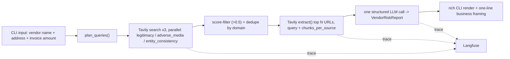

# Vendor Trust Agent

A Tavily-powered, cited, pre-payment vendor risk check designed to plug into an accounts-payable (AP) invoice review step. Give it a vendor name (and optionally an address and invoice amount) and it returns a structured, source-linked risk report — a guardrail before payment, not a replacement for AP process or formal vendor due diligence.

```
$ uv run vendor_trust_agent.py "Acme Textiles LLC" --address "Dallas, TX" --invoice-amount 45231.00

Invoice $45,231.00 | Risk: NEEDS_MANUAL_REVIEW | Hold payment for manual verification
before payment — remittance details could not be independently confirmed.
```

## Setup

1. **Tavily API key** — [app.tavily.com](https://app.tavily.com) (free tier: 1,000 credits/month)
2. **Nebius API key** — [tokenfactory.nebius.com](https://tokenfactory.nebius.com)
3. **Langfuse keys** (optional, for tracing) — [cloud.langfuse.com](https://cloud.langfuse.com) free tier
4. Install [`uv`](https://docs.astral.sh/uv/) if you don't have it: `curl -LsSf https://astral.sh/uv/install.sh | sh`
5. Copy `.env.example` to `.env` and fill in the keys above:
   ```
   cp .env.example .env
   ```
6. `uv sync` will install dependencies automatically on first run — no separate install step needed.

## Usage

```bash
uv run vendor_trust_agent.py "Acme Textiles LLC" --address "Dallas, TX" --invoice-amount 45231.00
```

| Flag | Required | Description |
|---|---|---|
| `vendor_name` (positional) | Yes | Vendor name to check |
| `--address` | No | Vendor address/location, if known — improves entity-consistency checking |
| `--invoice-amount` | No | Invoice amount pending payment — carried through into the report and business framing |
| `--model` | No | Nebius model name (default: `moonshotai/Kimi-K2.6`) |

Run the labeled fixture eval:

```bash
uv run eval.py
```

## Why this exists

Vendor-focused fraud isn't a rare edge case in accounts payable — it's one of the fastest-growing attack patterns against the AP function specifically:

- **45% of organizations** reported vendor imposter fraud in 2024, up from 34% the year before, and invoice fraud rose from 14% to 24% — both are forms of business email compromise, which itself hit 63% of organizations as the #1 payments fraud vector. *(AFP 2025 Payments Fraud and Control Survey)*
- **Billing schemes** — the category that includes shell-company and fictitious-vendor fraud — accounted for 22% of all occupational fraud cases (424 cases) with a **$100,000 median loss per case**. *(ACFE 2024 Report to the Nations)*
- Business email compromise alone caused **$2.77 billion in reported losses** across 21,442 incidents in the US in 2024. *(FBI IC3 2024 Internet Crime Report)*

The pattern behind most of these losses isn't a technically sophisticated hack — it's a plausible-looking vendor name, a slightly-off remittance detail, or a brand-new "supplier" nobody independently verified before the first invoice got paid. Extraction-confidence gates on invoice *data* (OCR quality, line-item matching) don't catch this, because the invoice itself can be perfectly well-formed — the problem is upstream of the document, in whether the vendor is who they claim to be. This tool is a narrow, purpose-built check for that specific gap: a fast, cited, pre-payment signal an AP reviewer can act on in seconds, not a full KYB (Know Your Business) platform.

## Architecture

Deterministic pipeline, not a freeform agent loop: fixed retrieval steps feeding one bounded LLM synthesis call. See [`TECHNICAL_STATEMENT.md`](TECHNICAL_STATEMENT.md) for why that's the deliberate design choice for a financial risk decision.



- **`vendor_trust/evidence.py`** — 3 targeted Tavily searches in parallel (legitimacy via `topic="finance"`, adverse media via `topic="news"` + `time_range="year"`, entity consistency via a general query), score-filtered (`score >= 0.5`) and deduped by domain before anything is extracted — then a targeted `extract()` call on only the shortlisted URLs so the model reasons over real page text, not search snippets.
- **`vendor_trust/agent.py`** — one LLM call against the curated evidence, forced into the `VendorRiskReport` schema. Every `RiskSignal.finding` must carry a `Citation` back to a specific source.
- **`vendor_trust/schema.py`** — the fraud taxonomy (`vendor_impersonation`, `invoice_fraud`, `shell_company`) is named after real ACFE/AFP fraud categories, not a generic 1-10 risk score. `needs_manual_review` is a first-class tier for thin/ambiguous evidence — a small or brand-new legitimate vendor can look identical to a fictitious one on paper; the honest answer when evidence is thin is "verify this," not a guessed score.

## Limitations

This is a proof-of-concept research signal, not a compliance product. Specifically, it does **not**:

- **Perform sanctions/OFAC screening.** It surfaces adverse media and legitimacy signals only — a formal denied-party-list check requires a dedicated screening API against SDN/consolidated lists, not general web search. The system prompt explicitly instructs the model never to claim or imply a sanctions determination.
- **Catch well-resourced fraud with a clean web presence.** A sophisticated fraud operation with a professionally built fake website and no public complaints yet will look "clear" or "needs_manual_review" rather than "high" — web-evidence checks are a floor, not a ceiling.
- **Reliably disambiguate generic or very common vendor names.** "Apex Trading LLC"-style names collide with many unrelated real entities; the entity-consistency check helps but doesn't solve this. When in doubt, the model is instructed to fall back to `needs_manual_review` rather than guess.
- **Detect typosquatting against your specific known-vendor list.** True vendor-impersonation detection (e.g. "this invoice claims to be from your existing vendor X, but the remittance bank details changed") requires cross-referencing your internal vendor master, which this tool doesn't have access to — see Future Work.
- **Verify remittance/banking details directly.** It checks *identity and reputation* signals, not bank-account ownership — pairing this with a positive-pay or bank-account-verification step is a natural next layer, not a replacement.

## Data handling

Only the vendor name, address, and invoice amount you provide are sent to Tavily and Nebius as part of the evidence-gathering and synthesis calls — no payment credentials, bank account numbers, or other PII beyond what you explicitly pass on the command line. Web content retrieved by Tavily is treated as untrusted data in the synthesis prompt (not as instructions) as a light prompt-injection guard, since a scam vendor's own website is itself part of the evidence being analyzed.

## Future Work

Explicitly out of scope for this build — noted here rather than half-built in code:

- **Client/industry config layer** — this build is a horizontal core engine; a real deployment would let a client configure which document/business registries and news sources to weight per industry and jurisdiction.
- **Caching** — repeated checks on the same vendor within a review window currently re-run the full pipeline; an obvious cost/latency win.
- **Human-override feedback loop** — capturing "AP clerk marked this needs_manual_review as actually fine" (or vice versa) to tune thresholds and prompts over time. Without this, the system makes the same calibration mistakes indefinitely.
- **Known-vendor-master cross-reference** — the real fix for typosquatting/impersonation detection: compare the invoice's claimed vendor + remittance details against your existing approved vendor list, not just the open web.
- **Formal KYB/sanctions integration** — a dedicated business-verification and denied-party-list API (e.g. Middesk, ComplyAdvantage) as a second, authoritative layer alongside this web-evidence signal.

## For Finance Leadership

Vendor fraud costs a median $100,000 per confirmed case and rarely announces itself with a suspicious-looking invoice — the document is usually clean; the vendor isn't. This tool adds one automated checkpoint before payment: a cited, few-cents-per-check research pass an AP clerk would otherwise spend 5-10 minutes doing manually, run on every new or unfamiliar vendor instead of only the ones that happen to look risky. It doesn't replace vendor onboarding or a formal fraud program — it closes the gap between "the invoice extracted cleanly" and "we actually confirmed who we're paying."
